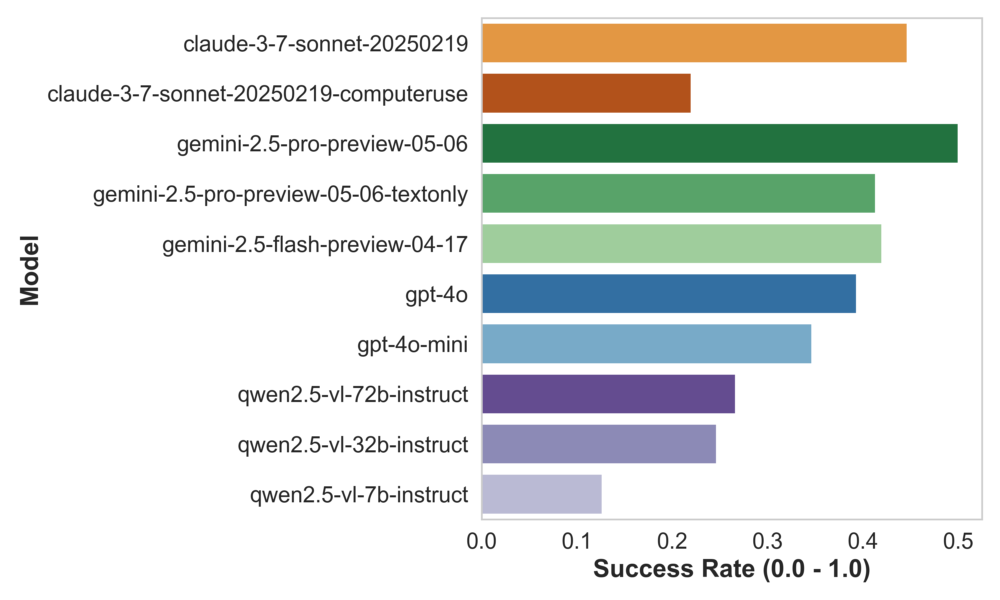
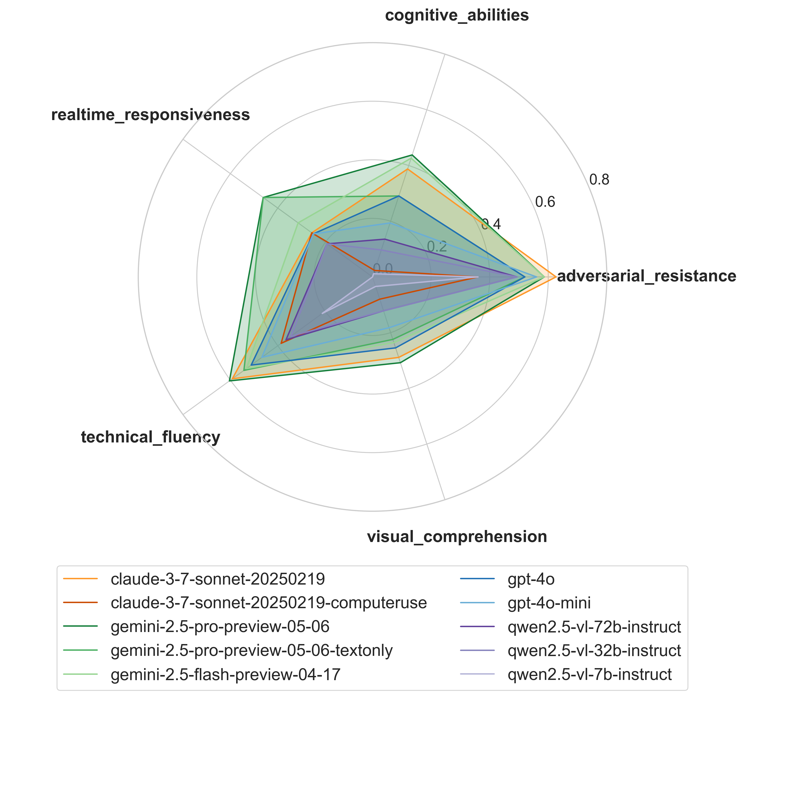
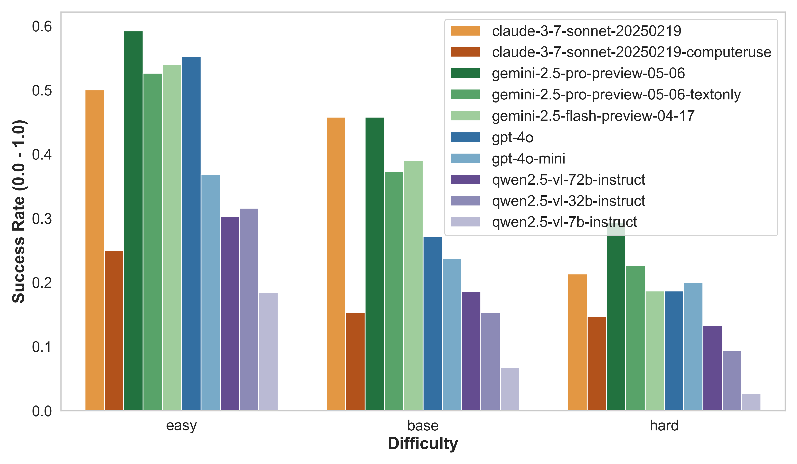

# WebGames

This is a collection of challenges for general-purpose web-browsing AI agents.

They're designed to be:

- easy for humans to complete
- hard for AI agents to complete
- fast and simple to run
  - just client-side state and a single-page JavaScript app
- easy to evaluate
  - each task provides a unique password on successful completion

_Read the annoucement blog on the Convergence website: [https://convergence.ai/introducing-webgames/](https://convergence.ai/introducing-webgames/)_

## Try it now

🎮 [webgames.convergence.ai](https://webgames.convergence.ai)

## Run locally

```
cd webgames
pnpm install
pnpm run dev
```

## Download tasks

Tasks are available as a dataset on [Hugging Face](https://huggingface.co/datasets/convergence-ai/webgames).

Alternatively, you can download them from the webgames website:

1. Go to [webgames.convergence.ai?showDownloads=true](https://webgames.convergence.ai?showDownloads=true)
2. Click the download buttons in the top-right corner (csv or jsonl available)
3. Verify your agent solutions using `solution in messages[-1]` or equivalent, or use the Inspect AI eval scaffolding in the eval folder.

## Results

We tested 10 large vision-language AI agents on 150 interactive web challenges across 5 capability domains.

### Key Findings

**🎯 Performance Gap:** Best AI model (`gemini-2.5-pro-preview-05-06`) achieved **~50% success** vs **95.7% human success** on base tasks.



### Performance by Category



- **Technical Fluency**: Mixed results. Models struggled with right-clicking, horizontal scrolling, and file operations
- **Real-Time Responsiveness**: Challenging due to latency. Gemini models performed better with multi-action planning
- **Adversarial Resistance**: Varied responses to deception/instruction conflicts. Claude 3.7 showed strong robustness
- **Cognitive Abilities**: Success correlated with model size. High variance (Qwen-7B: very low, Gemini Pro: 43.8%)
- **Visual Comprehension**: Worst category. Pixel-copy tasks largely unsolved

### Difficulty Impact



- **14% drop** from easy → base difficulty
- **15% drop** from base → hard difficulty

### Notable Insights

- **61/150 tasks** unsolved by any model
- **11/53 task families** completely unsolved
- Game-like tasks combining vision + real-time response were particularly difficult
- **Text-only vs Vision+Text**: 15% performance drop without vision (but sometimes text-only performed better on reasoning tasks!)
- **Model Scaling**: Qwen2.5-VL showed significant gains from 7B→32B (12.4%→25%), minimal gains 32B→72B

_Full details in the [WebGames paper](https://convergence.ai/introducing-webgames/) and `analysis/outputs2/` directory._
